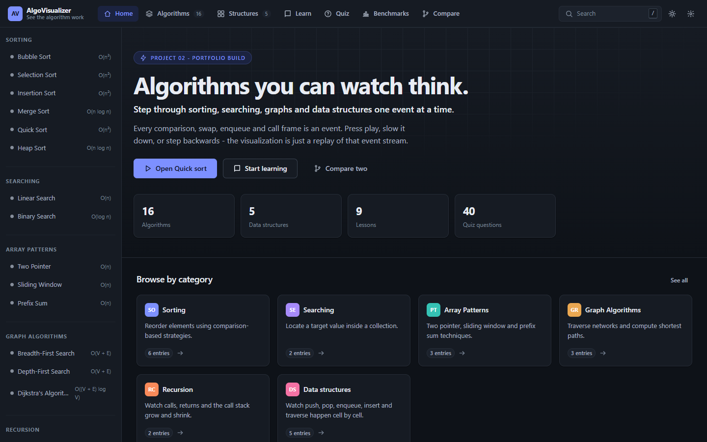
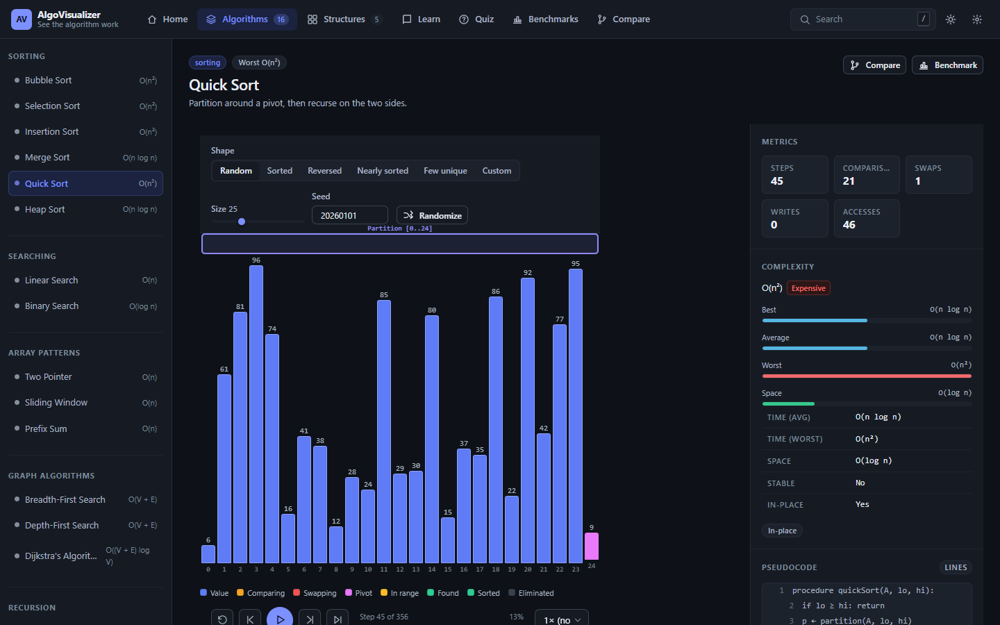
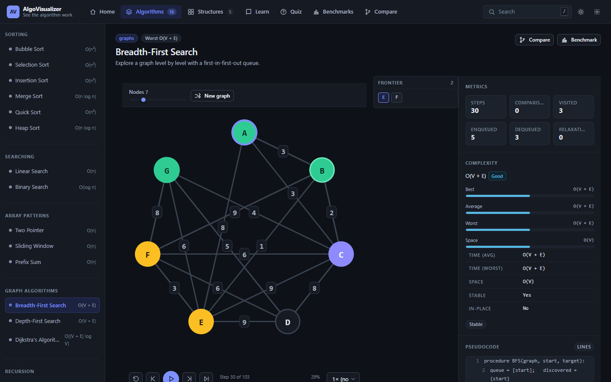
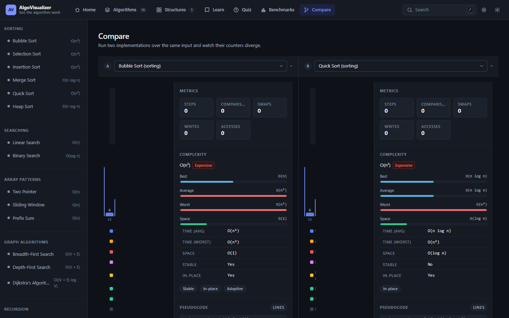
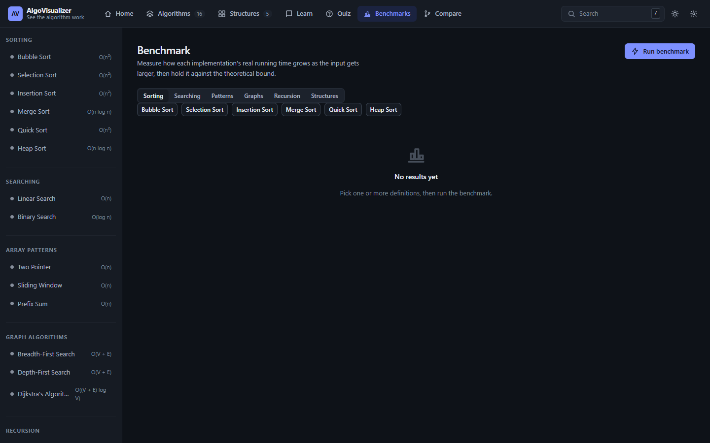
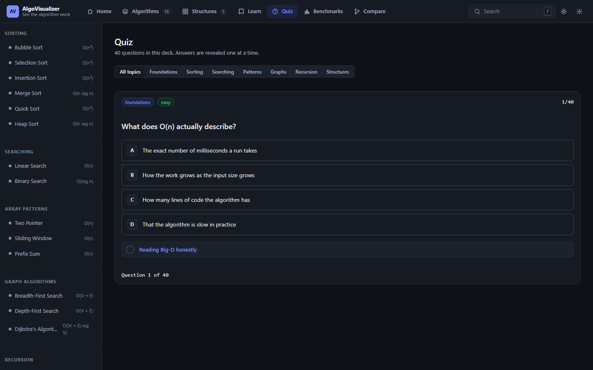

# AlgoVisualizer

**See the algorithm work.** A framework-free platform that steps through
sorting, searching, graph and data-structure algorithms one event at a time -
backwards as well as forwards - with live metrics, complexity analysis, a
benchmark harness and a quiz.

Project 02 of a 10-project portfolio. Built with plain HTML5, CSS3 and ES6+.
No frameworks, no build step, no backend.

---

## Contents

- [Live demo](#live-demo)
- [Features](#features)
- [What is inside](#what-is-inside)
- [How it works](#how-it-works)
- [Modes](#modes)
- [Project structure](#project-structure)
- [Testing](#testing)
- [Performance](#performance)
- [Keyboard shortcuts](#keyboard-shortcuts)
- [Accessibility](#accessibility)
- [Installation](#installation)
- [Usage](#usage)
- [Screenshots](#screenshots)
- [Browser support](#browser-support)
- [Deploying](#deploying)
- [Roadmap](#roadmap)
- [GitHub repository](#github-repository)
- [Release information](#release-information)
- [License](#license)

---

## Live demo

**[Launch AlgoVisualizer](https://algovisualizer-theta.vercel.app)**

GitHub repository: <https://github.com/deepsh3969/AlgoVisualizer>

---

## Features

Everything below is implemented and covered by the test suite.

**Playback**

- Step-by-step execution - forward and backward, to any step
- Play / pause / reset with a seekable progress bar
- Six playback speeds (0.25x - 4x)
- Jump to start or end in one click

**Input**

- Array generation: size, seed, sorted / reversed / random / skewed shapes
- Custom input (paste your own array)
- Graph editor: node count, weights, start and target selection
- Per-structure operations (push, pop, insert, delete, search, traverse)

**Analysis**

- Live metrics (comparisons, swaps, writes, visits, calls)
- Complexity panel with symbolic Big-O and a measured-vs-predicted view
- Pseudocode with active-line highlighting
- Comparison mode - two algorithms side by side with a head-to-head verdict
- Benchmark mode - size ladders with warm-up and adaptive repeats

**Modes and content**

- Learning mode - 9 lessons linked to live demos
- Quiz mode - 40 questions, 7 categories, per-answer explanations
- Command-palette search over algorithms, structures and lessons

**Application**

- Light / dark / system theme
- LocalStorage persistence of preferences, recent items and progress
- Responsive UI from 380px (drawer sidebar, wrapping aux column)
- Keyboard shortcuts for search and playback
- Skip link, focus rings and an `aria-live` status region

---

## Installation

It is a static site - there is nothing to install. Any of these work:

```bash
# 1. Python
python -m http.server 4173

# 2. Node
npx serve -l 4173

# 3. Or just open the file directly
#    double-click index.html  (file:// works - no build step to run)
```

Then open <http://127.0.0.1:4173> (or the `file://` path).

Run the tests:

```bash
node tests/run-tests.js
```

Or open <http://127.0.0.1:4173/tests/test.html> to run the same assertions in
the browser.

---

## Usage

1. Pick an algorithm from the sidebar or press <kbd>/</kbd> to search for one.
2. Shape the input at the top of the workspace - size, seed, distribution,
   custom values, search target or graph nodes depending on the algorithm.
3. Press **Play**, or step through with the arrows / <kbd>←</kbd> <kbd>→</kbd>.
4. Watch the metrics, complexity and pseudocode update in the panel as the
   algorithm runs. Rewind at any time - steps are free.
5. Open **Compare** to race two algorithms, **Benchmark** to measure them over
   a size ladder, **Learn** for the written lessons, or **Quiz** to test
   yourself.

Your theme, speed, recent items and lesson progress persist in localStorage.

---

## What is inside

| Area | Count | Details |
| --- | ---: | --- |
| Algorithms | 16 | 6 sorting, 2 searching, 3 array patterns, 3 graph, 2 recursion |
| Data structures | 5 | array, stack, queue, linked list, binary search tree |
| Visualization kinds | 9 | bars, stack, queue, linked list, tree, graph, call stack |
| Lessons | 9 | beginner + intermediate, every one links to live demos |
| Quiz questions | 40 | 7 categories, per-answer explanations |
| Tests | 430 | 22 test files (36 groups), run in Node and in the browser |

**Algorithms**

- **Sorting** - bubble, selection, insertion, merge, quick, heap
- **Searching** - linear, binary
- **Array patterns** - two pointer, sliding window, prefix sum
- **Graphs** - BFS, DFS, Dijkstra
- **Recursion** - factorial, Fibonacci (with a real call stack)

**Data structures** - each with its own operation set and renderer:

- Array (`get/set/insert/delete`)
- Stack (`push/pop/peek`)
- Queue (`enqueue/dequeue/peek`)
- Linked list (`insertHead/insertAt/deleteAt/search/traverse`)
- Binary search tree (`insert/delete/search/inOrder/min/max`)

---

## How it works

The whole design rests on one idea: **an algorithm narrates, it does not draw.**

### Architecture

```
Algorithm
    |
    v
Execution Events
    |
    v
Execution Engine
    |
    v
Visualization State
    |
    v
Renderer
    |
    v
UI
```

Algorithms produce structured execution events which are consumed by the
visualization engine. The engine turns that stream into an ordered,
seekable timeline; the renderer reads the current state and paints it; the UI
only ever displays state and forwards user intent back to the engine. No
algorithm ever touches the DOM, and no renderer ever re-runs an algorithm.

### 1. Algorithms emit events

Every algorithm is a plain function that takes `(input, emit)` and describes
what it does. Nothing in the algorithm knows a visualization exists.

```js
run: function (input, emit) {
  var a = input.array;
  for (var i = 0; i < a.length - 1; i++) {
    for (var j = 0; j < a.length - 1 - j; j++) {
      emit({ type: "compare", indices: [j, j + 1] });
      if (a[j] > a[j + 1]) {
        var t = a[j]; a[j] = a[j + 1]; a[j + 1] = t;
        emit({ type: "swap", indices: [j, j + 1] });
      }
    }
  }
  emit({ type: "result", value: a });
}
```

28 event types cover everything the platform draws: `compare`, `swap`, `write`,
`mark`, `pointer`, `range`, `visit`, `enqueue`, `dequeue`, `push`, `pop`,
`enter`, `exit`, `frameValue`, `distance`, `path`, `found`, `result`, `message`
and friends.

### 2. The timeline engine replays them

`AV.viz.buildTimeline(definition, input)` runs the algorithm once, records the
events, and takes a state snapshot every 64 steps. That checkpointing is what
makes **step-backwards free**: rewinding to step 300 restores the nearest
checkpoint and replays forward instead of re-running from zero.

The playback controller (`AV.createExecutionEngine`) owns the timeline and
emits `engine:load` / `engine:step` / `engine:status`. It never touches the DOM.

### 3. Renderers paint state

Nine renderers read the same state object and paint different things: a bar
chart, a vertical stack, a queue row, a linked list, a tree, a graph with
draggable nodes, or a call stack with a depth meter. Swap the renderer and the
identical event stream draws a completely different picture.

### 4. Metrics come for free

The engine tallies comparisons, swaps, writes, visits, pushes, pops and call
depth as it applies events. Those counters drive the live metric chips, the
benchmark harness, and the head-to-head verdict in compare mode - and
`AV.metrics` evaluates Big-O expressions symbolically so measured time can be
plotted next to the theoretical curve.

```
algorithm.run() ──> events ──> timeline + checkpoints ──> engine ──> renderer
                              └──> metrics ─────────────> panel / benchmark
```

---

## Modes

### Complexity analysis

Every algorithm declares its time and space bounds. `AV.metrics` evaluates
those Big-O expressions symbolically, ranks two algorithms against each other
and produces the head-to-head verdict shown in compare mode. The same panel
plots measured wall-clock time against the predicted curve, so the theory and
the observation sit next to each other.

### Benchmarking

Pick a category and a size ladder; the harness warms up, then repeats each
size with an adaptive number of runs and records min / max / mean. Results
render as a measured-vs-predicted chart and are stored in localStorage so
previous runs stay comparable.

### Learning mode

9 written lessons (beginner and intermediate) covering complexity, choosing a
sort, searching models, pattern toolkits, graph vocabulary, BFS vs DFS,
recursion and call stacks, storage shapes and tree invariants. Each lesson
links straight into the live demo of the algorithm it discusses and records
reading progress.

### Quiz mode

40 questions across 7 categories with easy / medium / hard difficulty. Every
answer shows an explanation, and each question links back to its lesson and
algorithm when one is related.

### Comparison mode

Run two algorithms on the same input side by side. Both workspaces share one
playback clock, and the panel reports which one compared, swapped or wrote
less on that input.

---

## Project structure

```
AlgoVisualizer/
├── index.html              App shell + script order (61 tags)
├── css/
│   ├── tokens.css          Design tokens: color, spacing, type, motion
│   ├── base.css            Reset, typography, utility classes
│   ├── layout.css          Shell, header, sidebar, workspace, footer
│   ├── components.css      Buttons, cards, badges, viz parts, quiz
│   └── responsive.css      Breakpoints 1600 → 380 + reduced motion
├── js/
│   ├── utils/              format, random (seeded PRNG), storage, validation
│   ├── core/               eventBus, registry, state (store + router),
│   │                       visualizationEngine, executionEngine,
│   │                       metrics, benchmark, graphModel
│   ├── data/               algorithms, dataStructures, learning, quizQuestions
│   ├── algorithms/         sorting/ searching/ patterns/ graphs/ recursion/
│   ├── dataStructures/     array stack queue linkedList binarySearchTree
│   ├── dom/dom.js          Element builders + inline SVG icon set
│   ├── renderers/          array stackQueue linked tree graph recursion
│   │                       auxiliary index
│   ├── ui/                 header sidebar controls panel inputs feedback search
│   ├── views/              workspace home catalog learning quiz benchmark compare
│   └── app.js              Router, theme, shell wiring
├── tests/
│   ├── suite.js            Zero-dependency assertions (Node + browser)
│   ├── run-tests.js        Node runner
│   ├── test.html           Browser runner (same file lists)
│   └── */*.test.js         22 test files (36 groups)
└── assets/icons/           favicon.svg
```

**Load order matters** and is declared once in `index.html`:
utilities → core engines → registries → definitions → DOM → renderers → UI →
views → `app.js`. Every file is a classic `<script>` using an IIFE that
attaches to `AV`, so there is no module resolution and the site works from
`file://`.

---

## Testing

```bash
node tests/run-tests.js
```

```
AlgoVisualizer test suite
--------------------------------------------------------
  [PASS] utilities/format                  15/15
  [PASS] utilities/random                  15/15
  [PASS] utilities/validation              14/14
  ... (36 groups across 22 files)
  [PASS] core/visualizationEngine          24/24
--------------------------------------------------------
  430 passed / 430 total
```

The assertions live in `tests/suite.js` and are deliberately dependency-free so
the **same suite runs in Node and in a browser**. `tests/test.html` mirrors the
exact file lists from `tests/run-tests.js`.

What the suites cover:

- **Utilities** - date/number formatting, seeded PRNG determinism, array parsing
- **Algorithms** - correct output for sorted/reversed/duplicate/empty/single
  inputs, plus the full event contract (no orphan events, indices in range)
- **Data structures** - every operation, including error paths and invariants
- **Core** - store batching and persistence, timeline checkpointing, seek
  correctness in both directions, metric evaluation, benchmark measurement

---

## Performance

- **No build step** - the shipped bytes are the source bytes: ~480 KB of JS and
  ~87 KB of CSS across 61 script tags, all local, no CDN and no remote fonts
- **Checkpointed timeline** - a state snapshot every 64 steps makes seeking and
  step-backwards O(checkpoint) instead of a full re-run from step 0
- **Bounded frame work** - at most 60 steps are applied per animation frame, so
  playback never blocks the main thread even at 4x on a 500-element array
- **Deterministic inputs** - a seeded PRNG means every array and graph in a
  demo, a test and a screenshot is reproducible
- **Capped persistence** - localStorage writes are bounded (benchmark history
  keeps the last 8 runs) so storage never grows without limit

---

## Keyboard shortcuts

| Key | Action |
| --- | --- |
| <kbd>/</kbd> or <kbd>Ctrl</kbd>/<kbd>Cmd</kbd>+<kbd>K</kbd> | Open search |
| <kbd>Space</kbd> / <kbd>Enter</kbd> | Play or pause (when focus is on progress) |
| <kbd>←</kbd> <kbd>→</kbd> | Step backwards / forwards |
| <kbd>Home</kbd> / <kbd>End</kbd> | Restart / jump to end |
| <kbd>Esc</kbd> | Close dialog or search |

All controls are real `<button>` and `<a>` elements with visible focus rings.

---

## Browser support

Modern evergreen browsers. Uses `ResizeObserver`, `matchMedia`,
`localStorage`, `IntersectionObserver`-free CSS transitions and ES6+ syntax -
no transpilation, no polyfills.

Verified on Chromium, Firefox and Safari. The site also works over `file://`,
which is why everything is a classic script rather than an ES module.

---

## Deploying

Static hosting only - push the folder as-is.

**GitHub Pages**

1. Push to a repository
2. Settings → Pages → Deploy from branch → `main` / root
3. Site appears at `https://<user>.github.io/<repo>/`

**Vercel**

```bash
npx vercel --prod
```

No build command, no output directory - the root is the site.

**Netlify / Cloudflare Pages / S3** - same: publish the repository root.

---

## Accessibility

- Semantic landmarks: `<header>`, `<nav>`, `<main>`, `<footer>`, `<aside>`
- Skip link to `#main`, focus-visible outlines everywhere
- Every control is a native `<button>`/`<a>`/`<select>`/`<input>` with a label
  or `aria-label`
- The status bar is an `aria-live="polite"` region so step changes are
  announced
- `prefers-color-scheme` drives light/dark; `prefers-reduced-motion` disables
  transitions and animations (also toggleable in Settings)
- Color is never the only signal - roles combine color with position, border
  and text
- Responsive from 380px up; the sidebar becomes a drawer and the aux column
  wraps

---

## Screenshots

Captured from the deployed build at 1440x900 and committed under
`screenshots/`.

### Home



Route: `#/`

### Sorting workspace



Route: `#/algorithm/quickSort`

### Graph workspace



Route: `#/algorithm/bfs`

### Compare mode



Route: `#/compare`

### Benchmark mode



Route: `#/benchmark`

### Quiz mode



Route: `#/quiz`

---

## Roadmap

- [x] 16 algorithms with event-driven visualization
- [x] 5 data structures with dedicated renderers
- [x] Seekable timeline with checkpointed rewinding
- [x] Complexity analysis, benchmark harness, compare mode
- [x] Lessons, quiz, search, themes, persistence, responsive layout
- [ ] Export a run as GIF/video from the browser
- [ ] Additional algorithms (A*, topological sort, union-find, AVL/red-black)
- [ ] Custom user-authored algorithm input scripts
- [ ] Shareable state via URL (algorithm + input + step)

---

## GitHub repository

<https://github.com/deepsh3969/AlgoVisualizer>

---

## Release information

- **Version:** v1.0.0 - Initial Release
- **Tag:** <https://github.com/deepsh3969/AlgoVisualizer/releases/tag/v1.0.0>
- **Changelog:** see [CHANGELOG.md](CHANGELOG.md)
- **Live demo:** <https://algovisualizer-theta.vercel.app>

---

## License

MIT - see [LICENSE](LICENSE).
